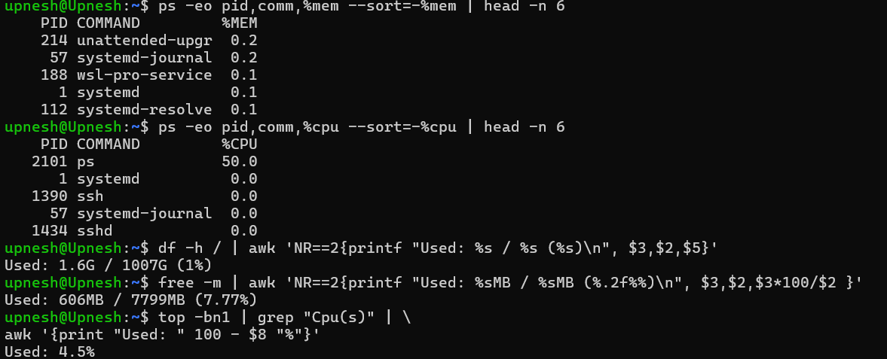

https://github.com/UpneshChaudhary/Devops.git


# #Server Performance Monitoring Script

This script provides a quick overview of your Linux system's health and performance, including:

- OS version
- Uptime
- Load averages
- CPU, memory, and disk usage
- Logged-in users
- Failed login attempts
- Top 5 processes by CPU and memory usage

---

## 📁 Prerequisites

Make sure the following are available on your system:

- Bash shell (`/bin/bash`)
- Basic CLI tools: `cat`, `uptime`, `who`, `top`, `ps`, `df`, `free`, `awk`, `grep`, `lastb` (for failed login attempts)

---

## 📝 Script Content

Save this as `server-stats.sh`:

```bash
#!/bin/bash

echo "===== Server Performance Stats ====="
echo ""

# OS version
echo "OS Version:"
cat /etc/os-release | grep PRETTY_NAME | cut -d= -f2 | tr -d '"'
echo ""

# Uptime
echo "Uptime:"
uptime -p
echo ""

# Load Average
echo "Load Average (1m, 5m, 15m):"
uptime | awk -F'load average:' '{ print $2 }'
echo ""

# Logged-in Users
echo "Logged-in Users:"
who | awk '{print $1}' | sort | uniq -c
echo ""

# Failed Login Attempts
echo "Failed Login Attempts:"
lastb | grep -c 'tty'
echo ""

# CPU Usage
echo "Total CPU Usage:"
top -bn1 | grep "Cpu(s)" | awk '{print "Used: " 100 - $8 "%"}'
echo ""

# Memory Usage
echo "Memory Usage:"
free -m | awk 'NR==2{printf "Used: %sMB / %sMB (%.2f%%)\n", $3,$2,$3*100/$2 }'
echo ""

# Disk Usage
echo "Disk Usage (/):"
df -h / | awk 'NR==2{printf "Used: %s / %s (%s)\n", $3,$2,$5}'
echo ""

# Top 5 Processes by CPU
echo "Top 5 Processes by CPU Usage:"
ps -eo pid,comm,%cpu --sort=-%cpu | head -n 6
echo ""

# Top 5 Processes by Memory
echo "Top 5 Processes by Memory Usage:"
ps -eo pid,comm,%mem --sort=-%mem | head -n 6
echo ""

echo "===== End of Report ====="


